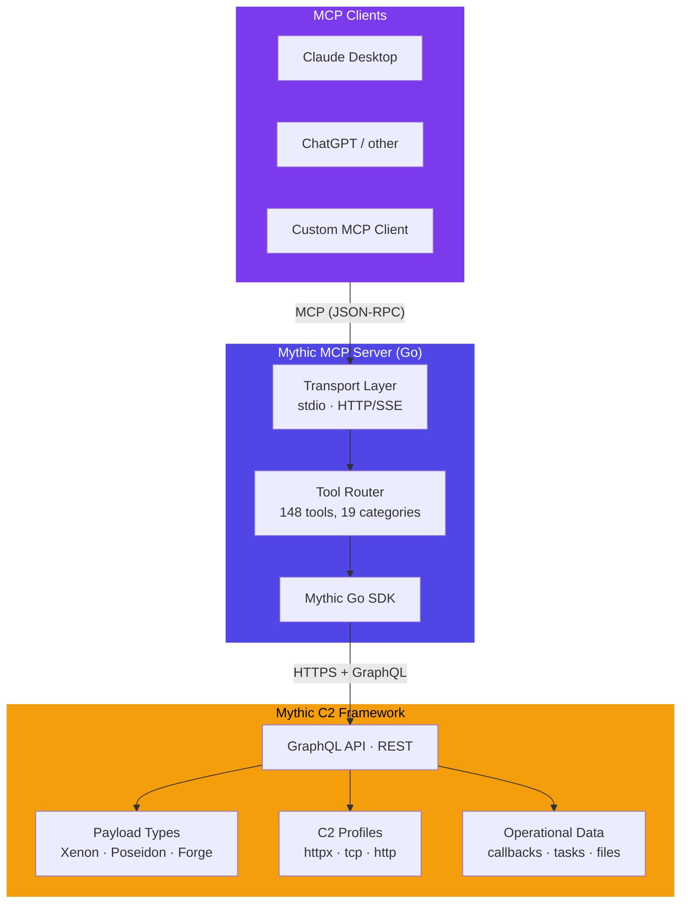
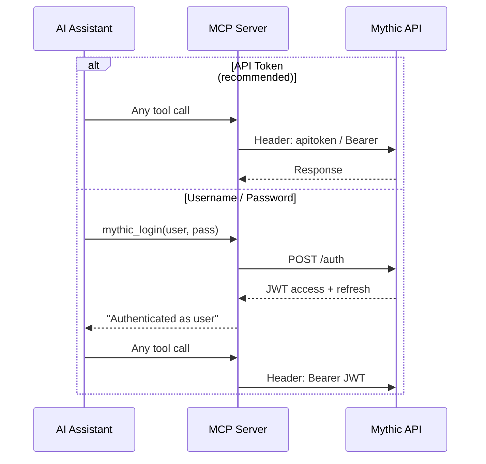

# Architecture

## System Overview

Mythic MCP Server is a **bridge** between the
[Model Context Protocol](https://modelcontextprotocol.io) and the
[Mythic C2 Framework](https://github.com/its-a-feature/Mythic).



## Transport Modes

The server supports two MCP transport modes:

| Mode | Use Case | Config |
|------|----------|--------|
| **stdio** | Claude Desktop, local CLI tools | Default — no extra config |
| **HTTP/SSE** | Remote clients, Docker containers, shared access | `MCP_TRANSPORT=http MCP_HTTP_PORT=3333` |

## Tool Registration

At startup the server registers every tool with the MCP SDK. Each tool
declaration includes:

- **Name** — a stable identifier like `mythic_issue_task`
- **Description** — natural-language explanation the AI reads to decide when to call it
- **Input Schema** — JSON Schema for parameters (auto-derived from Go structs via `jsonschema` tags)

The tool reference pages in this site are **generated directly from the source
code** to stay in sync automatically.

## Authentication Flow



The SDK automatically detects whether `MYTHIC_API_TOKEN` contains a real
API token or a JWT, and picks the correct auth header format.

## Project Layout

```
Mythic-MCP/
├── cmd/mythic-mcp/       # Entrypoint
├── pkg/
│   ├── config/           # Env-based configuration
│   └── server/
│       ├── server.go     # MCP server lifecycle
│       ├── tools_*.go    # Tool registration + handlers (18 files)
│       └── errors.go     # SDK → MCP error translation
├── tools/
│   └── gen-schema-docs/  # Schema → Markdown generator
├── site/                 # This documentation site
├── tests/                # E2E integration tests
└── mkdocs.yml            # Site configuration
```
