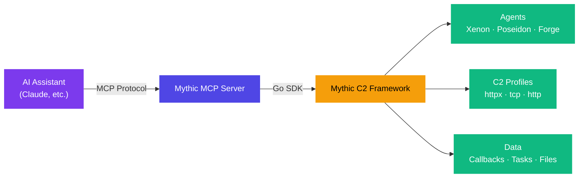

---
hide:
  - navigation
  - toc
---

<div class="hero" markdown>

# :zap: Mythic MCP Server

<p class="tagline">
AI-powered red team operations — give your AI assistant full control of the
<a href="https://github.com/its-a-feature/Mythic">Mythic C2 Framework</a>.
</p>

[:octicons-mark-github-16: View on GitHub](https://github.com/nbaertsch/Mythic-MCP){ .md-button .md-button--primary }
[:material-book-open-variant: Tool Reference](tools/index.md){ .md-button }

</div>

<div class="stats" markdown>
<div class="stat-card" markdown>
<div class="number">148</div>
<div class="label">MCP Tools</div>
</div>
<div class="stat-card" markdown>
<div class="number">19</div>
<div class="label">Categories</div>
</div>
<div class="stat-card" markdown>
<div class="number">Go</div>
<div class="label">Language</div>
</div>
<div class="stat-card" markdown>
<div class="number">MCP</div>
<div class="label">Protocol</div>
</div>
</div>

---

## What is this?

Mythic MCP Server is a **Model Context Protocol** server that wraps every
operation in the [Mythic C2 Framework](https://github.com/its-a-feature/Mythic)
as a structured MCP tool, so AI assistants like **Claude**, **ChatGPT**, or any
MCP-compatible client can:

- :key: **Authenticate** with Mythic instances
- :package: **Build and deploy** payloads (Xenon, Poseidon, Forge, …)
- :satellite: **Manage callbacks** — issue tasks, read output, pivot
- :file_folder: **Upload / download** files, screenshots, keylogs
- :shield: **Map MITRE ATT&CK** techniques to every action
- :bar_chart: **Query operations** — hosts, credentials, artifacts, processes

All through natural language — the AI translates intent into the right tool
calls automatically.

---

## Architecture



The server is a thin, type-safe translation layer between the MCP wire
protocol and the
[Mythic Go SDK](https://github.com/nbaertsch/mythic-sdk-go). Every tool
validates inputs against a JSON Schema, calls the SDK, and returns structured
results the AI can reason about.

---

## Tool Categories at a Glance

| Category | Tools | Description |
|----------|:-----:|-------------|
| [Authentication](tools/authentication.md) | 7 | Login, logout, API tokens, session management |
| [Operations](tools/operations.md) | 11 | Campaign management, event logs, global settings |
| [Operators](tools/operators.md) | 12 | User accounts, preferences, invite links |
| [Callbacks](tools/callbacks.md) | 11 | Active agent sessions, P2P edges, tokens |
| [Tasks & Responses](tools/tasks.md) | 18 | Issue commands, read output, OPSEC bypass |
| [Payloads](tools/payloads.md) | 12 | Build, download, manage agent binaries |
| [Payload Discovery](tools/payload-discovery.md) | 3 | Build params, C2 params, command lists |
| [C2 Profiles](tools/c2-profiles.md) | 10 | Profile lifecycle, IOCs, sample messages |
| [Commands](tools/commands.md) | 3 | Command schema and parameter introspection |
| [Files](tools/files.md) | 8 | Upload, download, preview, bulk export |
| [Credentials & Artifacts](tools/credentials.md) | 14 | Credential store and IOC / forensic evidence tracking |
| [MITRE ATT&CK](tools/mitre-attack.md) | 6 | Technique lookup, task/command/operation mapping |
| [Hosts](tools/hosts.md) | 5 | Host inventory, network topology |
| [Processes](tools/processes.md) | 5 | Process enumeration and tree views |
| [Screenshots](tools/screenshots.md) | 6 | Capture, timeline, thumbnail, download |
| [Keylogs](tools/keylogs.md) | 3 | Keylogger data retrieval |
| [Tags](tools/tags.md) | 10 | Tagging system for any Mythic object |
| [Documentation](tools/documentation.md) | 2 | Browse agent/C2 docs from within the AI |

---

## Quick Start

```bash
# Build
go build -o mythic-mcp ./cmd/mythic-mcp

# Run (stdio mode for Claude Desktop)
MYTHIC_URL=https://mythic:7443 \
MYTHIC_API_TOKEN=your-token \
  ./mythic-mcp

# Run (HTTP/SSE mode for remote clients)
MCP_TRANSPORT=http MCP_HTTP_PORT=3333 \
MYTHIC_URL=https://mythic:7443 \
MYTHIC_API_TOKEN=your-token \
  ./mythic-mcp
```

See the [Getting Started](getting-started/index.md) guide for full instructions.

---

<div style="text-align:center; opacity:.6; margin-top:2rem" markdown>
Built with :heart: for the red team community
·
[Model Context Protocol](https://modelcontextprotocol.io)
·
[Mythic C2](https://github.com/its-a-feature/Mythic)
</div>
